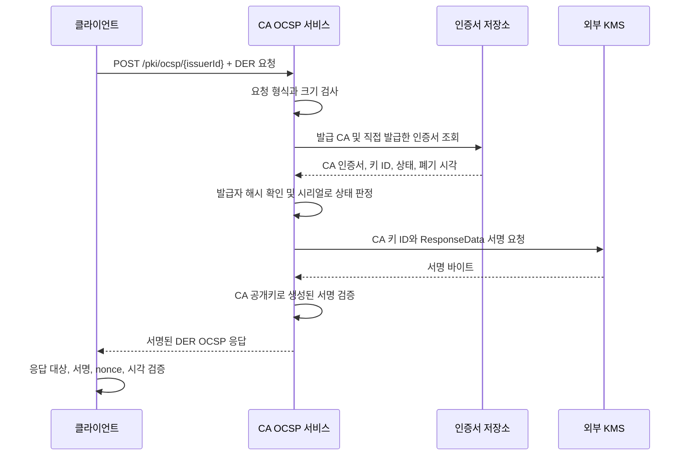

# Toy PKI

Java로 구현한 간단한 공개 키 기반 구조(PKI) 시스템입니다.

## 외부 KMS 연동

CA는 `/kms/api/v1` API를 통해 키 생성, 서명, 검증, 공개키 조회, 키 삭제를
`Toy-Project-KMS`에 위임합니다. 개인키와 키 저장소는 KMS에서 관리하며,
CA는 키 ID, 알고리즘 프리셋, 공개 메타데이터만 사용합니다.
현재 KMS API에는 검색 엔드포인트가 없어, CA가 키 목록을 받아 검색 조건에 맞게 필터링합니다.
서명과 검증에는 서명 알고리즘과 해시 알고리즘을 KMS에 직접 전달합니다.
CA에는 키 생성·서명을 위한 로컬 암호화 제공자나 관련 매개변수 계층을 두지 않습니다.

`Toy-Project-KMS` 디렉터리에서 KMS를 별도 포트로 실행합니다.

```bash
./gradlew bootRun --args='--server.port=8081'
```

이 저장소에서 CA를 실행합니다.

```bash
KMS_BASE_URL=http://localhost:8081 ./gradlew bootRun
```

설정값은 다음과 같습니다.

| 설정 속성 | 환경 변수 | 기본값 |
| --- | --- | --- |
| `kms.base-url` | `KMS_BASE_URL` | `http://localhost:8081` |
| `kms.connect-timeout` | `KMS_CONNECT_TIMEOUT` | `3s` |
| `kms.read-timeout` | `KMS_READ_TIMEOUT` | `30s` |

기본 URL에는 `/kms/api/v1`을 제외한 KMS 서버 주소를 지정합니다.
클라이언트는 중첩 객체 형태의 키 ID, Base64로 인코딩한 바이너리 필드,
`GET /keys/pub`의 JSON 요청 본문 등 현재 KMS API 규격을 따릅니다.
지원하는 서명 방식은 RSA PKCS#1 v1.5, ECDSA, Ed25519, Ed448입니다.
RSA-PSS와 DSA는 현재 KMS API에 구현되어 있지 않아 요청을 거부합니다.

KMS 연결 실패는 HTTP 503, 예상하지 못한 KMS 응답은 HTTP 502,
잘못된 KMS 요청은 HTTP 400, 존재하지 않는 키는 HTTP 404로 처리합니다.
이 오류들은 `@ControllerAdvice`를 사용하는 `KmsExceptionHandler`에서 공통 처리하고
기존 오류 페이지에 표시합니다. KMS 작업 로그에는 키 ID, 알고리즘, 처리 결과를 기록하며,
요청 데이터, 서명값, 키 자료, KMS 오류 응답 본문은 기록하지 않습니다.

## 프로파일 기반 인증서 발급

`MyCertificateService.issue(IssueCertificateCommand)`는 Bouncy Castle로 X.509 v3 인증서를
구성하고, DER로 인코딩한 서명 대상 데이터인 `TBSCertificate`를 KMS를 통해 서명합니다.
먼저 KMS에서 인증서 주체의 키를 생성하거나 선택한 뒤, 해당 키 ID를 전달합니다.

```java
CertificateId id = myCertificateService.issue(new IssueCertificateCommand(
    "Root CA", null, profileId, subjectKeyId, null,
    new CertificateSubject("V2G", "Example Root CA", null, "Example", "KR"),
    Set.of(), null, null, null
));
byte[] der = myCertificateService.findById(id.id()).getCertificate().getEncoded();
```

마지막 세 인자는 유효기간(일), 유효기간 시작 시각(`Instant`), 서명 알고리즘입니다.
생략하면 프로파일의 기본 유효기간, 현재 시각, 허용된 서명 알고리즘 중 호환되는 첫 번째 값을 사용합니다.
발급에는 활성 프로파일이 필요합니다. DN의 고정값은 사용자가 입력한 값보다 우선하며,
필수 DN 항목, 실제 주체 공개키의 매개변수, SAN 유형, 최대 유효기간을 서명 전에 검증합니다.

루트 CA 프로파일은 자체 서명 인증서를 생성합니다. 중간 CA와 최종 사용자 인증서 프로파일에는
미리 발급된 발급자 인증서의 ID가 필요합니다. 발급자 인증서는 활성 상태이고 현재 유효해야 하며,
`KEY_CERT_SIGN` 용도와 KMS 키 ID를 가지고 있어야 합니다.
하위 인증서의 유효기간은 발급자 인증서의 유효기간 안에 들어가야 합니다.
중간 CA의 경로 길이 제한은 발급자에게 남은 허용 범위를 넘을 수 없고,
값을 지정하지 않으면 그 범위 안으로 자동 제한합니다.

인증서에는 기본 제약 조건(Basic Constraints), 키 용도(Key Usage), 설정된 확장 키 용도
(Extended Key Usage)와 SAN, SKID, AKID를 포함합니다.
서명 알고리즘의 호환성은 주체 키와 별개로 발급자 키를 기준으로 확인합니다.
생성한 서명은 저장 전에 검증하며, 개인키는 KMS에서 관리합니다.
기존 `create` 메서드는 이미 생성된 인증서를 등록할 때 사용합니다.

`/pki/certificates`에서 **새 인증서 발급**을 선택하면 활성 프로파일을 사용해 인증서를 발급할 수 있습니다.
새 KMS 키를 생성하거나 호환되는 기존 키를 선택하고, 중간 CA·최종 사용자 인증서의 발급자를 지정하며,
DN, SAN, 유효기간, 서명 설정을 입력할 수 있습니다.
프로파일 검증에 실패하면 입력값을 유지하고, 이미 생성한 키가 있으면 같은 브라우저 세션에서 재시도할 때 재사용합니다.
새 키를 생성하기 전에 인증서 시리얼을 할당하며, 키 별칭은 대문자 16진수 시리얼을 사용한
`cert-<인증서 시리얼>`로 설정합니다. 재시도할 때 키와 할당된 시리얼을 함께 유지하고,
기존 키를 선택한 경우에는 원래 별칭을 유지합니다.

발급에 성공하면 키 상세 화면과 같은 탭 구성의 인증서 상세 창이 열립니다.
인증서 정보, 다운로드, OCSP 요청 탭을 제공하며, 목록에서는 검색, 상태·프로파일 필터, 정렬, 페이지 이동을 지원합니다.
상세 화면에서 실제 인증서 필드와 확장을 확인하고 PEM·DER 형식으로 다운로드할 수 있습니다.
목록과 상세 제목은 인증서 별칭을 사용하며, 별칭이 없거나 비어 있으면 시리얼을 표시합니다.
URL에는 저장된 인증서 ID를 사용합니다. 날짜 입력과 유효기간 표시는
`pki.time-zone` 설정을 따릅니다(환경 변수 `PKI_TIME_ZONE`, 기본값 `Asia/Seoul`).
현재 인증서 저장소는 메모리 기반이므로 CA를 재시작하면 발급된 인증서 정보가 사라집니다.

상세 창에서 **인증서 폐기**를 선택하고 시리얼의 마지막 16진수 6자리를 입력하면 해당 인증서를 폐기합니다.
확인값은 서버에서도 검사합니다. 반복 요청에도 최초 폐기 시각을 유지하며,
폐기 상태는 목록과 이후 생성하는 CRL·OCSP 응답에 반영됩니다.
폐기된 CA는 인증서를 추가로 발급하거나 CRL·OCSP 응답에 서명할 수 없습니다.

### CRL 다운로드와 OCSP

인증서 목록에서 **CRL 다운로드**를 선택한 뒤 CA를 지정하면 서명된 CRL을 DER·PEM 형식으로 받을 수 있습니다.
해당 CA는 활성 상태이고 현재 유효해야 하며, KMS 키와 `CRL_SIGN` 용도를 가지고 있어야 합니다.
다운로드할 때마다 해당 CA가 직접 발급한 인증서 중 폐기되거나 효력이 정지된 인증서를 담은 전체 CRL을 새로 생성합니다.
CRL에는 폐기 시각과 매번 증가하는 CRL 번호를 포함합니다.
폐기 사유에는 `unspecified`, 효력 정지 사유에는 `certificateHold`를 사용하며,
단순히 만료된 인증서는 CRL에 추가하지 않습니다.
`nextUpdate`는 생성 시각의 24시간 후와 CA 인증서 만료 시각 중 빠른 값입니다.

인증서 상세의 **OCSP 요청**은 nonce를 포함한 바이너리 OCSP 요청을 생성하여 내장 응답자에 전달합니다.
응답의 발급자, 조회 대상, nonce, 유효한 시각 범위, 서명을 검증한 뒤 결과를 표시합니다.
화면에서는 같은 프로세스 안에서 응답자를 호출하며, 외부 클라이언트는 같은 응답자를 HTTP로 호출할 수 있습니다.

- `GET /pki/certificates/{certificateId}/ocsp-request`: DER 형식의 OCSP 요청 파일을 다운로드합니다.
- `POST /pki/ocsp/{issuerCertificateId}`: `application/ocsp-request` 형식의 바이너리 요청을 보내고,
  `application/ocsp-response` 형식의 바이너리 응답을 받습니다.
- `GET /pki/certificates/crl?issuerId={issuerCertificateId}&format=DER`: CRL을 다운로드합니다.
  `format=PEM`도 지원합니다.

응답자는 CA의 발급·폐기 기록과 KMS 서명 키를 사용합니다.
상태는 `GOOD`, `REVOKED`(효력 정지 포함), `UNKNOWN` 중 하나로 반환합니다.
응답 유효기간은 최대 5분이며 CA 인증서 만료 시각을 넘지 않습니다.
[RFC 6960](https://www.rfc-editor.org/rfc/rfc6960.html#section-2.2)에 정의된 것처럼,
`GOOD`은 폐기 상태에 대한 조회 결과이므로 인증서 유효기간과 신뢰 체인은 별도로 검증해야 합니다.
요청 크기는 8 KiB, 조회할 인증서 ID는 20개로 제한합니다.
현재 외부 CDP·AIA URL 조회나 발급 인증서에 해당 확장을 추가하는 기능은 제공하지 않습니다.
폐기 기록은 인증서와 함께 메모리에 저장합니다.

### OCSP 동작 방식

OCSP는 특정 인증서의 폐기 상태를 요청하고, 서명된 응답으로 확인하는 프로토콜입니다.
이 프로젝트에서는 CA가 OCSP 응답자(responder) 역할도 수행합니다. 상태는 인증서 저장소에서
조회하고, 응답 서명은 외부 KMS에 맡깁니다. CRL과 OCSP는 같은 인증서·폐기 기록을 사용합니다.

구현의 진입점은 [CertificateStatusController](src/main/java/toy/pki/ca/web/certificate/CertificateStatusController.java)이고,
요청 생성·상태 조회·응답 생성·검증은
[BouncyCastleCertificateStatusService](src/main/java/toy/pki/ca/adapter/certificate/bouncycastle/BouncyCastleCertificateStatusService.java)가 담당합니다.

#### 1. 조회 경로와 요청 생성

- **화면 조회:** 상세 페이지의 OCSP 요청 버튼이 `POST /pki/certificates/{certificateId}/status-check`를
  호출합니다. `check()`는 `request()` → `respond()` → `verify()` 순서로 실행하고,
  검증한 결과를 상세 페이지에 표시합니다. 이때 OCSP 응답자를 호출하는 과정은 같은 프로세스 안에서 실행됩니다.
- **외부 클라이언트:** `GET /pki/certificates/{certificateId}/ocsp-request`로 요청 파일을 받거나
  OpenSSL로 직접 생성한 뒤, `POST /pki/ocsp/{issuerId}`로 전송합니다.
  API는 `respond()`가 만든 DER 응답을 반환하며, 클라이언트가 이를 검증합니다.

URL의 `certificateId`와 `issuerId`는 저장소의 UUID입니다. OCSP 요청 본문의 `CertID`는
다음 값으로 조회 대상을 식별합니다.

| 필드 | 의미 |
| --- | --- |
| `hashAlgorithm` | 발급자 이름·공개키 해시에 사용하는 알고리즘 |
| `issuerNameHash` | 발급자 DN의 해시 |
| `issuerKeyHash` | 발급자 공개키의 해시 |
| `serialNumber` | 조회할 인증서의 시리얼 번호 |

이 구성은 [RFC 6960의 CertID 정의](https://www.rfc-editor.org/rfc/rfc6960.html#section-4.1.1)를 따릅니다.
현재 `request()`는 발급자 해시에 SHA-1을 사용하고, 매번 임의의 32바이트 `nonce`를 넣습니다.
nonce는 요청과 응답을 연결하는 값으로, 응답에서 같은 값을 돌려받아 확인합니다.
응답 서명 알고리즘은 이 해시 설정과 별도로 CA 키에 맞춰 선택합니다.

#### 2. 상태 조회와 응답 서명

아래는 정상적인 외부 API 요청의 처리 흐름입니다.



응답을 만드는 CA는 `ACTIVE` 상태이며 현재 유효한 CA 인증서와 KMS 키 ID가 있어야 하고,
폐기 시각이 기록되어 있으면 안 됩니다. 요청의 발급자 해시가 해당 CA와 일치하는지 확인한 뒤,
그 CA가 직접 발급한 인증서 중 시리얼이 일치하는 항목을 찾습니다.
자체 서명 루트 CA를 조회할 때는 루트 CA 자신의 시리얼도 조회 대상에 포함합니다.

상태는 다음 표의 위쪽 조건부터 판정합니다.

| 저장소에서 확인한 상태 | OCSP 응답 |
| --- | --- |
| 일치하는 인증서가 없거나 저장된 상태가 `UNKNOWN` | `UNKNOWN` |
| `SUSPENDED` | `REVOKED`, 사유는 `certificateHold` |
| `REVOKED`이거나 폐기 시각(`revokedAt`)이 기록됨 | `REVOKED`, 사유는 `unspecified` |
| 위 조건에 해당하지 않음 | `GOOD` |

폐기 응답에는 저장된 폐기 시각을 포함합니다. 인증서를 폐기하면 저장소의 상태와 시각이 갱신되므로
다음 OCSP 요청에 반영됩니다. 만료만 된 인증서는 폐기 이력이 없다면 `GOOD`으로 응답합니다.
`GOOD`은 인증서의 유효기간이나 신뢰 체인까지 보증하는 값이 아니므로 이 검사는 별도로 수행합니다.
([RFC 6960 상태 정의](https://www.rfc-editor.org/rfc/rfc6960.html#section-2.2))

응답에는 상태와 함께 `thisUpdate`, `nextUpdate`, `producedAt`을 넣습니다.
`thisUpdate`와 `producedAt`은 응답 생성 시각이고, `nextUpdate`는 그 시각의 5분 후와
CA 인증서 만료 시각 중 빠른 값입니다. 요청에 nonce가 있으면 응답에도 같은 값을 포함합니다.

[KmsContentSigner](src/main/java/toy/pki/ca/adapter/certificate/bouncycastle/KmsContentSigner.java)는
Bouncy Castle이 만든 `ResponseData`의 DER 바이트를 CA의 KMS 키 ID와 함께
`POST /kms/api/v1/keys/sign`으로 보냅니다. KMS가 개인키로 서명하고 서명 바이트를 반환하면,
CA는 이를 발급 CA 인증서와 함께 `BasicOCSPResp`에 담습니다. 생성된 서명을 CA 공개키로 검증한 뒤
`OCSPResp`로 감싸 반환하며, 개인키는 KMS에 남습니다.

#### 3. 화면에 결과를 표시하기 전 검증

화면의 `check()`는 생성된 응답을 `verify()`로 다시 검사합니다.

- OCSP 처리 결과가 `successful`이고 응답 본문이 `BasicOCSPResp`인지 확인합니다.
- 요청과 응답이 각각 인증서 하나를 가리키고, `CertID`와 발급자가 일치하는지 확인합니다.
- 응답자 식별자가 CA와 일치하고, CA 공개키로 응답 서명이 검증되는지 확인합니다.
- 요청과 응답에 nonce가 모두 존재하며 같은 값인지 확인합니다.
- 지원하지 않는 필수 처리(`critical`) 응답 확장이 없는지 확인합니다.
- `nextUpdate`가 존재하고 아직 지나지 않았으며 `thisUpdate`보다 이르지 않은지 확인합니다.
  `thisUpdate`와 `producedAt`은 현재 시각보다 최대 5분까지만 앞설 수 있습니다.

모두 통과하면 `OcspCheckResult`에 상태, 폐기 시각, 응답 시각들과 `signatureValid=true`를 담습니다.
검증에 실패하면 화면에 오류를 표시합니다. 외부 API 사용자는 아래 curl 예제의 OpenSSL 명령 등으로
응답을 직접 검증하고, 사용하는 신뢰 저장소에 따른 인증서 체인 검증도 수행해야 합니다.

#### 4. 현재 구현 범위

요청은 최대 8 KiB, 인증서 ID 1~20개인 OCSP v1 요청을 받습니다. 서명된 요청과 필수 처리(`critical`) 요청 확장은
지원하지 않습니다. 외부 요청은 nonce를 생략할 수 있고, 포함하면 길이가 1~32바이트여야 합니다.
화면용 요청 생성·검증은 인증서 하나와 32바이트 nonce를 사용합니다.

정상 상태 응답은 매번 저장소를 조회하고 KMS로 서명하여 생성하며, HTTP 응답에는 `Cache-Control: no-store`를
설정합니다. 현재는 발급 CA가 직접 서명하며 별도의 위임 OCSP 서명 인증서는 사용하지 않습니다.
외부 OCSP 서버나 인증서 AIA URL을 조회하지 않으며, 인증서·폐기 정보는 메모리에 저장됩니다.
HTTP 오류와 OCSP 프로토콜 오류의 구분 및 실제 요청 명령은 다음 절에서 설명합니다.

### curl로 OCSP 호출하기

CA와 KMS를 실행한 뒤, CA 인증서와 해당 CA가 서명한 인증서를 발급합니다.
아래 ID에는 상세 URL(`/pki/certificates/{id}`)에 표시되는 저장소 UUID를 사용합니다.
인증서 시리얼 번호나 KMS 키 ID와는 다른 값입니다.
`ISSUER_ID`는 `CERT_ID`에 해당하는 인증서를 **직접 발급한 CA 인증서의 ID**입니다.
자체 서명 루트 CA를 조회할 때는 두 ID가 같습니다.

```bash
CA_URL='http://localhost:8080'
CERT_ID='<조회할 인증서 UUID>'
ISSUER_ID='<발급 CA 인증서 UUID>'

# 인증서 식별자와 nonce를 포함한 DER 형식의 OCSP 요청 파일 다운로드
curl --fail --silent --show-error \
  "$CA_URL/pki/certificates/$CERT_ID/ocsp-request" \
  --output ocsp-request.der

# 바이너리 데이터를 그대로 POST로 전송하고 DER 형식의 응답 저장
curl --fail --silent --show-error \
  "$CA_URL/pki/ocsp/$ISSUER_ID" \
  --header 'Content-Type: application/ocsp-request' \
  --header 'Accept: application/ocsp-response' \
  --data-binary @ocsp-request.der \
  --output ocsp-response.der

# 발급 CA 인증서를 다운로드한 뒤 서명된 응답 검증 및 확인
curl --fail --silent --show-error \
  "$CA_URL/pki/certificates/$ISSUER_ID/download?format=PEM" \
  --output issuer.pem

openssl ocsp -reqin ocsp-request.der -respin ocsp-response.der \
  -CAfile issuer.pem -partial_chain -resp_text
```

위 로컬 검증 예제에서는 다운로드한 발급 CA를 명시적으로 신뢰합니다. 중간 CA도 같은 방식으로 검증할 수 있습니다.
기존의 신뢰할 수 있는 루트 CA를 기준으로 검증하려면 검증 옵션을
`-CAfile root-ca.pem -verify_other issuer-chain.pem`으로 바꾸고,
`issuer-chain.pem`에 필요한 중간 CA 인증서를 넣습니다.

정상적으로 검증되면 `Response verify OK`와 함께 `Cert Status: good` 또는 `Cert Status: revoked`가 표시됩니다.
대상 인증서를 상세 창에서 폐기한 뒤 요청 파일 다운로드와 POST를 다시 실행하면,
변경된 상태와 폐기 시각을 확인할 수 있습니다.
이때 발급 CA는 활성 상태여야 하며, 서명 키를 KMS에서 사용할 수 있어야 합니다.

대상 인증서와 발급 CA 인증서를 이미 가지고 있다면 로컬에서 요청 파일을 직접 생성할 수 있습니다.

```bash
openssl ocsp -issuer issuer.pem -cert certificate.pem -nonce -reqout ocsp-request.der
```

HTTP 200은 OCSP 응답을 반환했다는 뜻이므로, 응답 안의 프로토콜 상태도 확인해야 합니다.
잘못된 DER 요청에는 OCSP `malformedRequest` 응답을, 발급자가 일치하지 않는 요청에는
`unauthorized` 응답을 반환합니다. 알 수 없는 인증서 시리얼에는 `Cert Status: unknown`을 반환합니다.
존재하지 않는 발급자 UUID는 HTTP 404, 지원하지 않는 요청 콘텐츠 유형은 HTTP 415로 처리합니다.
요청 생성과 응답 검증에 사용할 수 있는 옵션은
[OpenSSL OCSP 명령 참고 문서](https://docs.openssl.org/3.5/man1/openssl-ocsp/)에서 확인할 수 있습니다.

## 테스트

자동화 테스트는 도메인 계층과 서비스 계층을 대상으로 작성합니다.
도메인 테스트는 별칭 정규화와 인증서 상태 전이를 검증하고, 서비스 테스트는
프로파일 관리, 인증서 발급·폐기, CRL·OCSP 생성 및 검증, KMS 호출 전 입력 처리를 검증합니다.
외부 KMS는 테스트 대역(mock)으로 대체하며, 웹 서버를 실행하지 않고 서비스를 직접 호출합니다.
컨트롤러·화면·HTTP 어댑터의 요청/응답 형식은 이 테스트 범위에 포함하지 않습니다.

```bash
./gradlew test
```

## 프로젝트 정책

### 프로파일

이 프로젝트에서 권장하는 정책은 다음과 같습니다.

- `isCa`가 인증서를 발급하는 CA를 나타낸다면, `isCa == true`일 때 `KEY_CERT_SIGN`을 필수로 설정합니다.
- 모든 프로파일에 키 용도를 지정해야 하며, 비어 있는 `keyUsages` 집합은 허용하지 않습니다.
- CA 키를 서명과 암호화 또는 키 합의에 함께 사용하는 용도 조합을 제한합니다.

다음 규칙은 강제하지 않습니다.

- `isCa == false`일 때 `CRL_SIGN`을 금지하는 규칙
- `isCa == true`이면 항상 `CRL_SIGN`을 요구하는 규칙

CRL 서명 전용 인증서가 있을 수 있으며, 모든 CA가 CRL에 직접 서명하는 것은 아니기 때문입니다.
